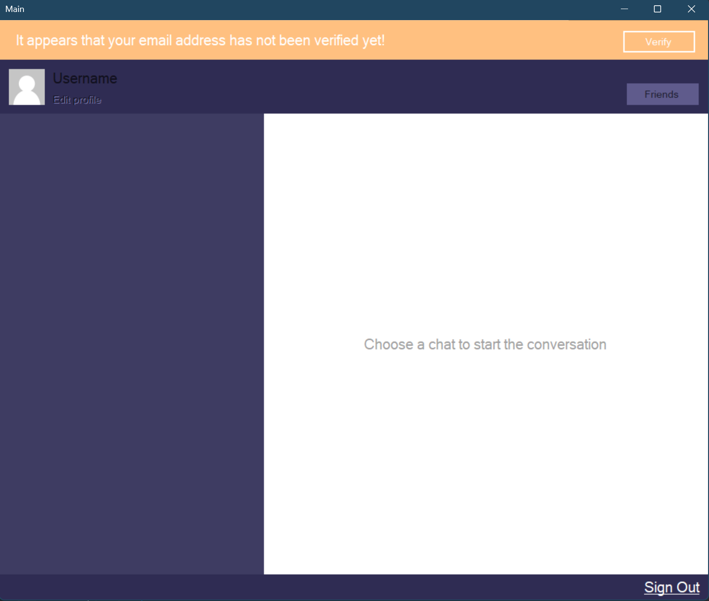

# ChatApp

## About

ChatApp is a chat application developed using Firebase and WinForms. It allows users to communicate in real-time through a user-friendly desktop interface.

## Screenshot


## Features

- **Real-Time Messaging**: Send and receive messages in real-time using Firebase.
- **User Authentication**: Secure user authentication and registration.
- **User Profiles**: Manage user profiles and settings.
- **Chat Rooms**: Create and join chat rooms for group conversations.
- **Message History**: View message history within chat rooms.

## Technologies Used

- **C# WinForms**: Framework for building the desktop application interface.
- **Firebase**: Provides real-time database and authentication services.
- **.NET Framework/Core**: Used for backend logic and operations.
- **Visual Studio**: Integrated development environment used for development.

## Installation

1. **Clone the Repository**:
    ```sh
    git clone https://github.com/BeratARPA/ChatApp.git
    ```
2. **Open with Visual Studio**: Open the project in Visual Studio.
3. **Install Dependencies**: Ensure all necessary dependencies are resolved.
4. **Configure Firebase**: Set up Firebase credentials and configuration in the application.
5. **Build the Project**: Build the solution to ensure proper setup.
6. **Run the Project**: Press F5 to run the project and access the chat interface.

## Usage

1. **Launch the Application**: Start the application from Visual Studio or the executable.
2. **Register/Login**: Use the authentication feature to register or log in.
3. **Create/Join Chat Rooms**: Create new chat rooms or join existing ones.
4. **Send/Receive Messages**: Use the chat interface to send and receive messages in real-time.

## Contributing

If you would like to contribute, please fork the repository, create a feature branch, and submit a pull request.

## License

This project is licensed under the MIT License. See the [LICENSE](LICENSE) file for more details.

## Contact

For questions or feedback, feel free to contact me:
- **Email**: [beratarpa@hotmail.com](mailto:beratarpa@hotmail.com)
- **GitHub**: [https://github.com/BeratARPA](https://github.com/BeratARPA)
